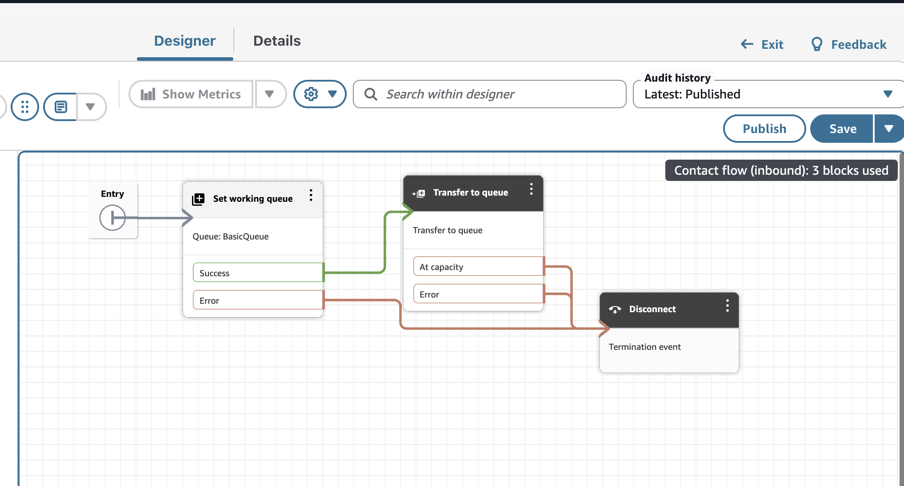

## Prerequisites / Prerrequisitos

---

### An Amazon Connect Instance / Una Instancia de Amazon Connect

🇺🇸 You need an Amazon Connect Instance. If you don't have one already you Acan [follow this guide](https://docs.aws.amazon.com/connect/latest/adminguide/amazon-connect-instances.html).

You will need the **INSTANCE_ID** of your instance. You can find it in the Amazon Connect console or in the instance ARN:

`arn:aws:connect:<region>:<account_id>:instance/INSTANCE_ID`

🇪🇸 Necesitas una instancia de Amazon Connect. Si aún no tienes una, puedes [seguir esta guía](https://docs.aws.amazon.com/connect/latest/adminguide/amazon-connect-instances.html) para crearla.

Necesitarás el **INSTANCE_ID** de tu instancia. Lo puedes encontrar en la consola de Amazon Connect o en el ARN de la instancia:

`arn:aws:connect:<region>:<account_id>:instance/INSTANCE_ID`

---

### A Chat Flow to Handle Messages / Un Flujo de Chat para Manejar Mensajes

🇺🇸 Have or create the expected experience a user will have with a contact. [Follow this guide](https://docs.aws.amazon.com/connect/latest/adminguide/create-contact-flow.html) to create an Inbound Contact flow. The simplest one will be ok.

(Remember to publish the flow!)

🇪🇸 Crea o ten listo el flujo de contacto que define la experiencia del usuario. [Sigue esta guía](https://docs.aws.amazon.com/connect/latest/adminguide/create-contact-flow.html) para crear un flujo de contacto entrante (Inbound Contact Flow). El más sencillo será suficiente.

(¡Recuerda publicar el flujo!)

---

🇺🇸 Take note of **INSTANCE_ID** and **CONTACT_FLOW_ID** in the Details tab, values are in flow ARN:

🇪🇸 Toma nota del **INSTANCE_ID** y **CONTACT_FLOW_ID** en la pestaña de Detalles. Los valores están en el ARN del flujo:

`arn:aws:connect:<region>:<account_id>:instance/INSTANCE_ID/contact-flow/CONTACT_FLOW_ID`
